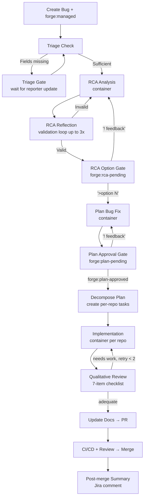

# Bug Workflow

Bugs go through a structured five-stage pipeline that produces a root cause analysis, a concrete fix plan, and implementation — all within a single Forge-managed workflow.

## Overview

## Triggering a Bug Workflow

Create a Jira issue with:

- **Issue type:** Bug
- **Label:** `forge:managed`

Forge detects the issue type and routes it through the bug pipeline.

## Stage Reference

### 1. Triage

Forge immediately acknowledges the ticket and evaluates it against a 7-field completeness checklist:

1. Steps to reproduce
2. Expected vs. actual behavior
3. Environment
4. Affected versions
5. Error output
6. Affected component
7. Disambiguating context

**If fields are missing:** Forge posts a targeted comment listing only the absent fields and sets `forge:triage-pending`. Update the ticket — Forge re-evaluates automatically.

**If sufficient:** Forge posts confirmation and starts RCA analysis.

---

### 2. RCA Analysis

Forge spawns a container that clones the relevant repo(s) and performs hypothesis-driven codebase exploration:

- Forms ranked candidate root causes
- Investigates each with `grep`, `git blame`, and file reads
- Accepts or rejects each hypothesis with evidence
- Writes `.forge/rca.json` with summary, code location, mechanism, confidence, and 1–4 fix options

The RCA then goes through a **reflection loop** (up to 3 iterations) where a second container validates it for correctness — confirming file/function existence, mechanism plausibility, distinct fix options, and git history attribution. Failures loop back to re-analysis with the critique.

---

### 3. RCA Option Gate

Forge posts the validated RCA as a structured Jira comment with numbered fix options and sets `forge:rca-pending`.

**Human actions:**
- **Select an option:** Reply with `>option N` (e.g., `>option 1`). Case-insensitive; can appear anywhere in the comment.
- **Request revision:** Start a comment with `!` — Forge regenerates the RCA incorporating your input.
- **Ask a question:** Prefix with `?` or `@forge ask` — Forge answers without advancing the workflow.

Plain comments (no prefix) are ignored by the workflow.

---

### 4. Planning

After option selection, Forge spawns a container to produce a concrete implementation plan covering specific files, tests, and order of operations. Each involved repository is tagged `repo:<owner>/<name>` for automatic task decomposition.

The plan is posted as a Jira comment and `forge:plan-pending` is set.

**Human actions:**
- **Approve:** Change label to `forge:plan-approved`.
- **Request revision:** Start a comment with `!` — Forge regenerates the plan with your feedback.
- **Ask a question:** Prefix with `?` or `@forge ask`.

Plain comments (no prefix) are ignored by the workflow.

---

### 5. Decompose → Implementation

After plan approval, Forge:

1. **Decomposes** the plan into one Jira Task per repository identified in the plan, each linked to the bug ticket.
2. **Clones** each repo into an isolated workspace.
3. **Implements** the fix using a container that follows the plan, using TDD with bidirectional test validation.
4. **Qualitative review:** A 7-item checklist verifies root-cause alignment, test proof, stability, plan scope adherence, call-site completeness, backward compatibility, and bidirectional validation. Up to 2 retry passes before proceeding.
5. **Updates documentation** (non-blocking).
6. **Creates a fork-based PR** with a release note section (Component, Fix, Root cause, Impact).
7. **CI validation** with automatic fix loop.
8. **Human review** gate.
9. **Post-merge summary:** After merge, Forge posts a fix summary and release note to the Jira ticket.

---

## Comment Syntax

At any approval gate, Forge classifies your comment by its prefix:

- **`!` prefix** — revision request: Forge regenerates the current artifact with your feedback
- **`?` prefix or `@forge ask`** — question: Forge answers and stays paused
- **`>option N`** — RCA option selection (RCA Option Gate only)
- **No prefix** — informational: ignored by the workflow

---

## Merge Conflicts

Bug fix PRs are created from fork branches. If `main` advances while the PR is open, merge conflicts can prevent CI from running. Post `/forge rebase` as a PR comment to trigger AI-assisted conflict resolution. See [PR Commands](pr-commands.md) for details.

---

## Key Differences from Feature Workflow

| | Feature | Bug |
|---|---|---|
| Planning stages | 4 (PRD → Spec → Epics → Tasks) | 5 (Triage → RCA → Options → Plan → Decompose) |
| Approval labels | `prd-approved`, `spec-approved`, `plan-approved`, `task-approved` | `plan-approved` |
| Implementation | Multi-task, multi-repo, parallel capable | Per-repo task, sequential |
| Post-merge | — | Fix summary + release note posted to Jira |

---

## Labels

| Label | Set by | Purpose |
|-------|--------|---------|
| `forge:managed` | Human | Activate Forge for this bug |
| `forge:triage-pending` | Forge | Ticket incomplete, waiting for reporter |
| `forge:rca-pending` | Forge | RCA posted, waiting for option selection |
| `forge:plan-pending` | Forge | Plan posted, waiting for approval |
| `forge:plan-approved` | Human | Approve plan, trigger decompose + implementation |
| `forge:blocked` | Forge | Workflow blocked, needs intervention |
| `forge:retry` | Human | Resume from the failed node |

See [Jira Labels](labels.md) for the full reference.
