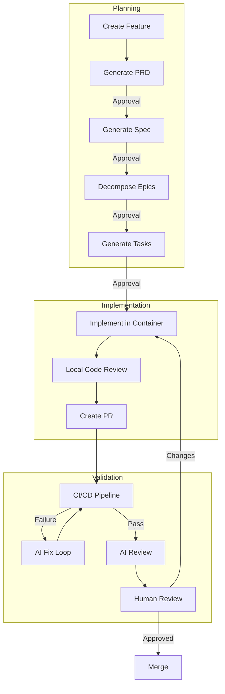
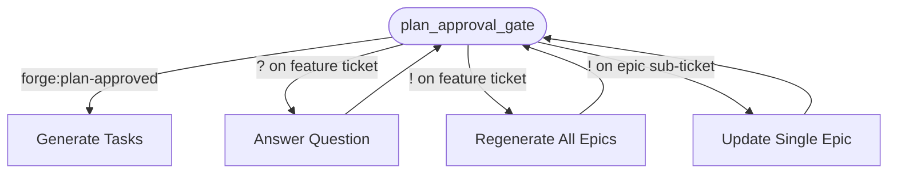
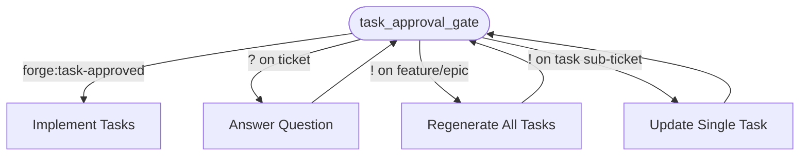

# Feature Workflow

Forge orchestrates features through a multi-stage pipeline with human approval gates at each planning step and automated execution for implementation.

## Overview



## Triggering a Workflow

Create a Jira issue with the `forge:managed` label. Forge listens for Jira webhooks and starts the pipeline automatically.

!!! note
    The issue type must be **Feature** (not Bug — see [Bug Workflow](bug-workflow.md)).

## Stage Reference

### PRD Generation

Forge reads the ticket description and generates a structured Product Requirements Document. The PRD is posted as a comment on the Jira ticket.

**Human action:** Review the PRD. Optionally ask questions with `?` prefix (see [Q&A Mode](#qa-mode)). When satisfied, change the label to `forge:prd-approved`.

---

### Spec Generation

Forge generates a behavioral specification from the approved PRD, typically using Given/When/Then acceptance criteria.

**Human action:** Review the spec. Ask questions with `?` or request revisions with `!`. Approve with `forge:spec-approved`.

---

### Epic Decomposition

Forge breaks the feature into logical epics — high-level areas of work that map to implementation phases.

**Human action:** Review the epic plan. You have four options at this stage:

| Action | How |
|--------|-----|
| Approve | Change label to `forge:plan-approved` |
| Ask a question | Comment with `?` prefix — Forge answers without re-decomposing |
| Revise one epic | `!` comment on the **specific epic sub-ticket** — Forge updates only that epic |
| Redo the full decomposition | `!` comment on the **feature ticket** — Forge regenerates all epics with your feedback |



---

### Task Generation

Forge generates granular implementation tasks scoped to individual repositories. Each task is sized to fit in a single container execution pass.

**Human action:** Review the tasks. You have four options at this stage:

| Action | How |
|--------|-----|
| Approve | Change label to `forge:task-approved` |
| Ask a question | Comment with `?` prefix — Forge answers without regenerating |
| Revise one task | `!` comment on the **specific task sub-ticket** — Forge updates only that task |
| Regenerate all tasks | `!` comment on the **feature or epic ticket** — Forge regenerates the full task list with your feedback |



---

### Implementation

Tasks are executed in ephemeral Podman containers. Each container:

- Clones the target repository
- Reads the task file
- Writes code, runs tests, commits
- Has no external network access

The orchestrator handles push and PR creation.

---

### Local Code Review

After implementation and before PR creation, Forge reviews the diff against `main` and fixes any breaking issues in-place (up to 2 passes).

---

### PR Creation

A fork-based pull request is created with an AI-generated description. The PR body is kept in sync with commits throughout the CI fix loop.

---

### CI/CD + Fix Loop

Forge waits for CI results via GitHub webhooks. On failure:

1. **Analyze** — categorizes the failure using the `analyze-ci` skill
2. **Fix** — implements a fix in-place using the `fix-ci` skill
3. **Review** — reviews the fix before pushing
4. Repeat up to 5 times

Each fix pass re-syncs the PR description. After CI passes, Forge proceeds to AI review.

To skip an infrastructure-related check, see [PR Commands](pr-commands.md).

---

### AI Review

Forge reviews the completed PR against the original spec, checking for completeness and correctness.

---

### Human Review

The PR is now ready for human review. Merge when satisfied, or request changes to trigger another implementation pass.

## Q&A Mode

At any approval gate, you can ask questions without triggering regeneration:

```
? Why did you choose this approach over X?
```

```
@forge ask explain the auth strategy
```

Forge answers based on the artifact content and generation context, then keeps the workflow paused. When you're ready to approve, change the label as normal.

A summary of all Q&A exchanges is posted to the ticket when you approve.

## Requesting Revisions

Start a comment with `!` followed by your feedback. Forge regenerates the current artifact incorporating your feedback, replacing the previous version.

```
! The spec is missing error handling for the webhook retry path
```

!!! note
    Comments without a recognized prefix (`!`, `?`, `@forge ask`) are treated as informational and ignored by the workflow. Only `!`-prefixed comments trigger regeneration.

## Handling Failures

If a stage fails, Forge:

1. Sets the `forge:blocked` label
2. Posts a comment tagging the reporter and assignee with the error

To retry, add the `forge:retry` label. Forge resumes from the exact node that failed — not from the beginning.

!!! tip "CI retries"
    If CI fix attempts are exhausted, `forge:retry` resets the attempt counter for a fresh budget of retries.

## Labels Summary

See [Jira Labels](labels.md) for the complete reference.
