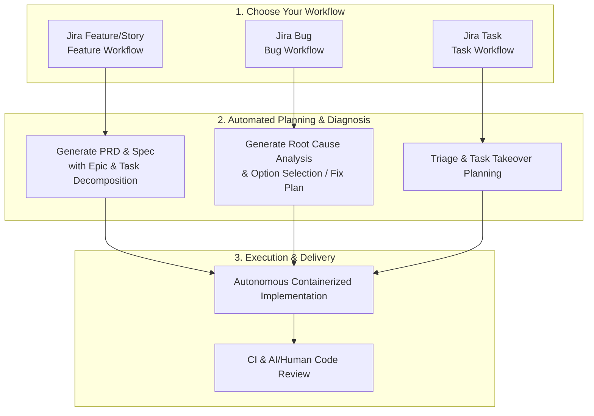

# Forge

Forge automates the software development lifecycle from ticket creation through code delivery using AI-powered planning and execution. It connects Jira, GitHub, and Claude to transform tickets into shipped code with human approval gates at each stage.

Forge supports three distinct, user-facing workflows depending on your ticket type and project requirements.

## How It Works

## Quick Links

- [Getting Started](getting-started.md) — Set up Forge in 10 minutes
- [Feature Workflow](guide/feature-workflow.md) — How features flow through Forge
- [Bug Workflow](guide/bug-workflow.md) — How bug diagnosis and implementation flow through Forge
- [Task Workflow](guide/task-workflow.md) — How standalone Tasks and Epics become PRs
- [Developer Guide](developer-guide.md) — Full local development reference
- [Skills System](skills/index.md) — Customize Forge for your stack
- [Contributing](dev/contributing.md) — How to contribute

## Supported Workflows

### 🚀 Feature Workflow
Used for long-term or large-scale product changes where requirements need detailed definition and structural design before writing code.
* **Process**: Progresses from initial Jira Feature to automated PRD generation, Technical Spec creation, Epic decomposition, and task implementation with rigorous human review gates at every planning step.
* **When to use**: Choose this workflow for net-new features, substantial architectural modifications, or projects requiring collaborative product/engineering alignment on requirements before any code is touched.
* **More Info**: Read the [Feature Workflow Guide](guide/feature-workflow.md).

### 🐛 Bug Workflow
Designed specifically for triaging, diagnosing, and resolving software defects efficiently.
* **Process**: Forge reproduces the issue inside an isolated sandbox, automatically drafts a detailed Root Cause Analysis (RCA) presenting alternative fix options, generates a concrete fix plan upon option selection, and implements the verified fix.
* **When to use**: Choose this workflow for reported bugs, unexpected crashes, test regressions, or any ticket where the root cause is unknown or multiple fix strategies need to be evaluated first.
* **More Info**: Read the [Bug Workflow Guide](guide/bug-workflow.md).

### 🛠️ Task Workflow
Tailored for already-scoped, standalone tickets or task takeovers that bypass the extended feature planning and decomposition phases.
* **Process**: Forge takes existing, clear engineering instructions directly from a Jira Task or Epic, generates a direct implementation plan, executes the changes in a sandbox, repairs CI, and opens a review-ready Pull Request.
* **When to use**: Choose this workflow for well-defined engineering chores, minor refactors, simple library upgrades, or whenever the technical implementation steps are already pre-determined and agreed upon.
* **More Info**: Read the [Task Workflow Guide](guide/task-workflow.md).

## Key Features

**AI-Powered Planning**
: PRD, spec, and task generation at each stage with human approval gates before moving forward.

**Q&A Mode**
: Ask clarifying questions at any approval gate without triggering regeneration. Start a comment with `?` or `@forge ask`.

**Automated Implementation**
: Code executed in ephemeral Podman containers with no external network access.

**CI Fix Loop**
: Automatic CI failure analysis and fixing, up to 5 retries. Skip infrastructure-related failures with `/forge skip-gate`.

**Skills System**
: Customizable per-project AI behavior. Override only what's specific to your stack; defaults cover the rest.

**Resumable Workflows**
: LangGraph checkpoints state to Redis after every step. Use `forge:retry` to resume from the exact node that failed.
